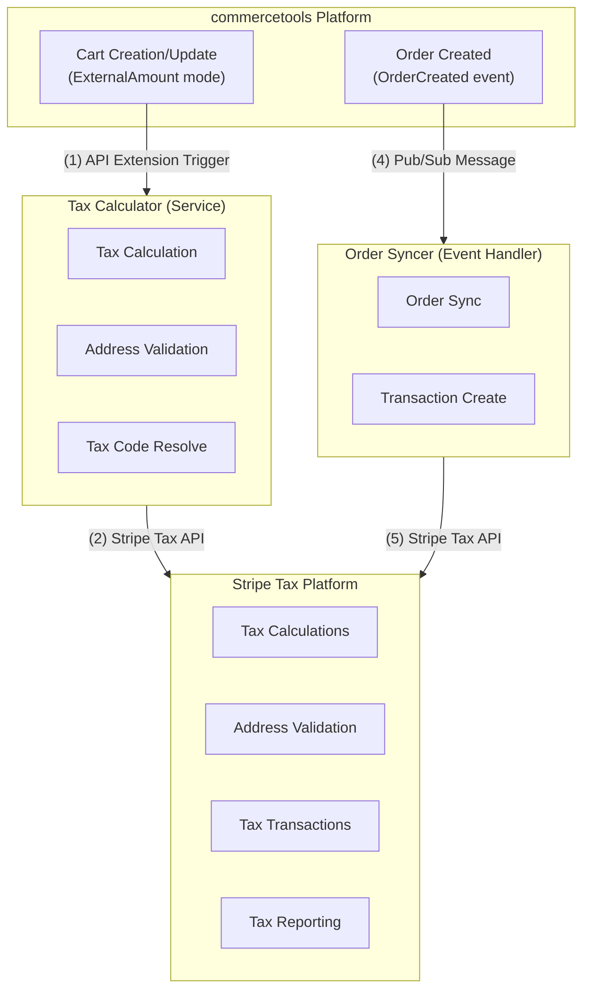

# Commercetools Stripe Tax Connector

This repository provides a production-ready [commercetools Connect](https://docs.commercetools.com/connect) connector that integrates **commercetools Composable Commerce** with **Stripe Tax** for automated sales tax calculation and transaction reporting.

The connector enables real-time tax calculation during checkout and synchronizes completed orders to Stripe for tax compliance and reporting. It uses [Cart](https://docs.commercetools.com/api/projects/carts) and [Order](https://docs.commercetools.com/api/projects/orders) data models from commercetools, [API Extensions](https://docs.commercetools.com/api/projects/api-extensions) for real-time tax calculation, and asynchronous [Subscriptions](https://docs.commercetools.com/api/projects/subscriptions) for order synchronization.

## Table of Contents

- [Key Features](#key-features)
- [Technologies Used](#technologies-used)
- [Prerequisites](#prerequisite)
- [Getting Started](#getting-started)
- [Architecture Overview](#architecture-overview)
- [Register as Connector](#register-as-connector)
- [Deployment Configuration](#deployment-configuration)
- [Environment Variables Reference](#environment-variables-reference)
- [Additional Resources](#additional-resources)

## Key Features

### Tax Calculator Module
- **Real-time Tax Calculation**: Automatic tax calculation when carts are created/updated via API Extensions
- **Address Validation**: Two-tier validation (local rules + Stripe verification) for shipping addresses with country-specific postal code formats for 23 supported countries
- **Tax Code Resolution**: 5-strategy hierarchical lookup (custom type category, custom field product, environment mapping, parent category traversal up to 10 levels, error fallback)
- **Ship-From Address Resolution**: Multi-strategy resolution (line item supply channel, inventory entry channel with priority/stock-based selection, default business address)
- **Tax Behavior Configuration**: Configurable inclusive/exclusive tax behavior by country mapping or merchant default
- **Multiple Shipping Support**: Handles both Single and Multiple shipping modes with parallel tax calculations and proportional line item distribution
- **Multi-Warehouse Support**: Groups line items by ship-from address for accurate tax jurisdiction calculations
- **Category Caching**: In-memory cache for product categories (5-minute TTL) to optimize performance
- **Batch Processing**: Efficient handling of large product catalogs (>500 products) with max 5 concurrent batch requests
- **Shipping Tax Code Lookup**: Retrieves tax codes from Stripe custom field on commercetools shipping methods
- **Tax Breakdown Matching**: 3-strategy algorithm (calculated amount, most common tax type, exact match) for accurate rate application
- **Error Handling**: Comprehensive error handling with specialized errors (ShipFromNotFoundError, TaxCodeNotFoundError) and Stripe error code mapping

### Order Syncer Module
- **Order Synchronization**: Automatic synchronization of completed orders to Stripe Tax Transactions
- **Transaction Reporting**: Creates tax transactions in Stripe for compliance and reporting
- **Event-Driven Architecture**: Uses Google Cloud Pub/Sub for reliable order processing
- **Idempotent Processing**: Detects existing transactions using regex extraction from Stripe error messages to avoid duplicates
- **Multi-Calculation Support**: Handles orders with multiple tax calculations (from multiple shipping methods)
- **PaymentIntent Integration**: Updates Stripe PaymentIntent metadata with comma-separated transaction IDs for reconciliation

## Technologies Used

### Core Technologies
- **Node.js**: JavaScript runtime environment
- **Express.js**: Web server framework for REST API endpoints
- **JavaScript (ES6+)**: Modern JavaScript with ES modules

### SDKs and Libraries
- **[commercetools SDK](https://docs.commercetools.com/sdk/js-sdk-getting-started)**: Official commercetools SDK for API communication
- **[Stripe Node.js SDK](https://github.com/stripe/stripe-node)**: Official Stripe SDK for Stripe Tax API integration
- **dotenv**: Environment variable management
- **lodash**: Utility library for data manipulation

### Testing
- **[Jest](https://jestjs.io/)**: JavaScript testing framework for unit and integration tests
- **[supertest](https://github.com/ladjs/supertest#readme)**: HTTP assertion library for API testing
- **[sinon](https://sinonjs.org/)**: Standalone test spies, stubs and mocks

### Development Tools
- **Babel**: JavaScript compiler for ES6+ support
- **ESLint**: Code linting and quality checks
- **npm**: Package manager and script runner

### Infrastructure & Services
- **commercetools Composable Commerce**: E-commerce platform
- **Stripe Tax**: Automated tax calculation and reporting service
- **Google Cloud Pub/Sub**: Event messaging for order synchronization
- **commercetools Connect**: Connector deployment platform

## Prerequisite
#### 1. commercetools composable commerce API client
Users are expected to create API client responsible for API extension creation as well as fetching cart and order details from composable commerce project, API client should have enough scope to be able to do so. These API client details are taken as input as an environment variable/ configuration for connect. Details of composable commerce project can be provided as environment variables (configuration for connect) `CTP_PROJECT_KEY` , `CTP_CLIENT_ID`, `CTP_CLIENT_SECRET`, `CTP_SCOPE`, `CTP_REGION`. For details, please read [Deployment Configuration](./README.md#deployment-configuration).

#### 2. Stripe Tax Account
Users are expected to have a Stripe account with Stripe Tax enabled. The Stripe API token is required for tax calculations and order synchronization. API token can be provided as environment variable (configuration for connect) `STRIPE_API_TOKEN`. For details, please read [Deployment Configuration](./README.md#deployment-configuration).

**Stripe Tax Setup Requirements:**
- Stripe Tax must be activated in your Stripe Dashboard
- Head office address must be configured in Stripe Tax settings
- Tax registration must be completed for the countries where you sell
 
## Getting Started

The connector contains two separate modules:

### Tax Calculator
Provides a REST API to calculate tax amounts through Stripe Tax by processing cart details. It is triggered automatically by commercetools API Extension when a cart (in frozen state with tax mode as ExternalAmount) is created or updated.

**Key Capabilities:**
- Real-time tax calculation during checkout
- Address validation with Stripe verification
- Tax code resolution from product categories
- Ship-from address resolution
- Support for multiple shipping methods
- Configurable tax behavior (inclusive/exclusive)

For detailed documentation, see [Tax Calculator README](tax-calculator/README.md)

### Order Syncer
Receives messages from commercetools project when orders are created. The order and cart details are synchronized to Stripe Tax as transactions for accounting, compliance, and tax reporting purposes.

**Key Capabilities:**
- Automatic order synchronization via Google Cloud Pub/Sub
- Stripe Tax Transaction creation
- Transaction reference linking for reporting

For detailed documentation, see [Order Syncer README](order-syncer/README.md)

## API Extension Trigger Conditions

The Tax Calculator API Extension is triggered based on the following conditions (DSL):

```
taxMode="ExternalAmount"
AND lineItems is defined
AND lineItems is not empty
AND (shippingInfo is defined OR lineItems(shippingDetails is defined))
AND (
  paymentInfo is not defined
  OR (taxedPrice is not defined AND custom(fields(connectorStripeTax_calculationReferences is defined)))
  OR (shippingMode="Single" AND shippingInfo is defined AND shippingInfo(taxedPrice is not defined)
      AND custom(fields(connectorStripeTax_calculationReferences is defined)))
)
AND (taxMode has changed OR lineItems has changed OR shippingInfo has changed
     OR shippingAddress has changed OR shipping has changed
     OR itemShippingAddresses has changed)
```

**Key Behaviors:**
- Only triggers for carts with `taxMode="ExternalAmount"`
- Requires at least one line item and shipping information
- **Normal path**: skips when `paymentInfo` exists and cart is already fully taxed (transitioning to order)
- **Re-apply path**: re-applies an existing Stripe calculation (without creating a new one) when `paymentInfo` is present but `taxedPrice` was cleared by a CT platform update (e.g. `setShippingAddress`) and `connectorStripeTax_calculationReferences` are already stored on the cart
- Timeout: 2000ms

## Architecture Overview



## Custom Types Created

The connector automatically creates the following custom types during post-deploy:

### Product Tax Custom Type
- **Key**: `connector-stripe-tax-product` (configurable via `CUSTOM_TYPE_PRODUCT_KEY`)
- **Applied To**: `product-price`, `line-item`
- **Field**: `connectorStripeTax_TaxCode` (String) - Stripe tax code for the product

### Category Tax Custom Type
- **Key**: `connector-stripe-tax-category` (configurable via `CUSTOM_TYPE_CATEGORY_KEY`)
- **Applied To**: `category`
- **Field**: `connectorStripeTax_TaxCode` (String) - Stripe tax code for the category

### Shipping Tax Custom Type
- **Key**: `connector-stripe-tax-shipping` (configurable via `CUSTOM_TYPE_SHIPPING_KEY`)
- **Applied To**: `shipping-method`
- **Field**: `connectorStripeTax_TaxCode` (String) - Stripe tax code for shipping

### Cart/Order Tax Custom Type
- **Key**: `connector-stripe-tax-calculation-reference` (configurable via `CUSTOM_TYPE_CART_KEY`)
- **Applied To**: `cart`, `order`
- **Fields**:
  - `connectorStripeTax_calculationReferences` (Array of String) - Stripe calculation IDs
  - `connectorStripeTax_amountTotal` (Number) - Total amount including tax
  - `connectorStripeTax_taxAmountExclusive` (Number) - Exclusive tax amount
  - `connectorStripeTax_taxAmountInclusive` (Number) - Inclusive tax amount
  - `connectorStripeTax_currencies` (Array of String) - Currencies used in calculations
  - `connectorStripeTax_expiresAt` (Array of String) - Calculation expiration timestamps
  - `connectorStripeTax_calculationTimestamp` (DateTime) - When calculation was performed

## Register as Connector

Follow guidelines [here](https://docs.commercetools.com/connect/getting-started) to register the connector for public/private use in commercetools Connect.

## Deployment Configuration
In order to deploy your customized connector application on commercetools Connect, it needs to be published. For details, please refer to [documentation about commercetools Connect](https://docs.commercetools.com/connect/concepts)
In addition, in order to support connect, the tax integration connector template has a folder structure as listed below
```
├── tax-calculator
│   ├── src
│   ├── test
│   └── package.json
├── order-syncer
│   ├── src
│   ├── test
│   └── package.json
└── connect.yaml
```

Connect deployment configuration is specified in `connect.yaml` which is required information needed for publishing of the application. The configuration uses two main sections:

- **`deployAs`**: Module-specific configuration for each connector component
- **`inheritAs`**: Shared configuration inherited by all modules

### Configuration Structure

```yaml
deployAs:
  - name: tax-calculator
    applicationType: service
    endpoint: /taxCalculator
    scripts:
      postDeploy: npm install && npm run connector:post-deploy
      preUndeploy: npm install && npm run connector:pre-undeploy
    configuration:
      standardConfiguration:
        # Tax Calculator specific variables (see below)

  - name: order-syncer
    applicationType: event
    endpoint: /orderSyncer
    scripts:
      postDeploy: npm install && npm run connector:post-deploy
      preUndeploy: npm install && npm run connector:pre-undeploy
    configuration:
      standardConfiguration:
        # Order Syncer specific variables (see below)

inheritAs:
  configuration:
    standardConfiguration:
      # Shared variables inherited by both modules
    securedConfiguration:
      # Sensitive variables (secrets) inherited by both modules
```

### Environment Variables Reference

#### Shared Configuration (Both Modules)

These variables are defined in the `inheritAs` section and shared by both modules:

| Variable | Required | Secured | Description |
|----------|----------|---------|-------------|
| `CTP_PROJECT_KEY` | Yes | No | Project key from commercetools composable commerce project |
| `CTP_REGION` | Yes | No | Region of commercetools composable commerce project (e.g., `us-central1.gcp`, `europe-west1.gcp`) |
| `CTP_CLIENT_ID` | Yes | Yes | Client ID from commercetools composable commerce project |
| `CTP_CLIENT_SECRET` | Yes | Yes | Client secret from commercetools composable commerce project |
| `CTP_SCOPE` | Yes | Yes | Scope from commercetools composable commerce project |
| `STRIPE_API_TOKEN` | Yes | Yes | API Token for communication between the connector and Stripe Tax provider |

#### Tax Calculator Module Configuration

These variables are specific to the Tax Calculator module:

| Variable | Required | Default | Description |
|----------|----------|---------|-------------|
| `CUSTOM_TYPE_PRODUCT_KEY` | Yes | `connector-stripe-tax-product` | Custom type key for product and line item tax code configuration |
| `CUSTOM_TYPE_CATEGORY_KEY` | Yes | `connector-stripe-tax-category` | Custom type key for category tax code configuration |
| `CUSTOM_TYPE_SHIPPING_KEY` | Yes | `connector-stripe-tax-shipping` | Custom type key for shipping method tax code configuration |
| `CUSTOM_TYPE_CART_KEY` | Yes | `connector-stripe-tax-calculation-reference` | Custom type key for cart tax calculation reference |
| `TAX_BEHAVIOR_DEFAULT` | No | `exclusive` | Sets the default tax behavior for all tax calculations (`inclusive` or `exclusive`) |
| `TAX_BEHAVIOR_COUNTRY_MAPPING` | No | See below | JSON string mapping country codes to their default tax behavior |
| `TAX_CODE_CATEGORY_MAPPING_JSON` | Yes | - | JSON string mapping commercetools categories to Stripe tax codes |
| `SHIP_FROM_REQUIRED` | No | `true` | Whether to require a ship-from address for tax calculations |
| `SHIP_FROM_DEFAULT_BUSINESS_COUNTRY` | No | - | Default country for ship-from address |
| `SHIP_FROM_DEFAULT_BUSINESS_STATE` | No | - | Default state/province for ship-from address |
| `SHIP_FROM_DEFAULT_BUSINESS_CITY` | No | - | Default city for ship-from address |
| `SHIP_FROM_DEFAULT_BUSINESS_POSTAL_CODE` | No | - | Default postal code for ship-from address |
| `SHIP_FROM_DEFAULT_BUSINESS_LINE1` | No | - | Default street address line 1 |
| `SHIP_FROM_DEFAULT_BUSINESS_LINE2` | No | - | Default street address line 2 |
| `SHIP_FROM_CHANNEL_PRIORITY` | No | - | Comma-separated channel IDs for priority-based selection (e.g., `channel-1,channel-2`) |
| `ADDRESS_VALIDATION_STRIPE_DEFAULT_CURRENCY` | No | `usd` | Default currency for Stripe address verification |

**TAX_BEHAVIOR_COUNTRY_MAPPING Default Value:**
```json
{"US":"exclusive","CA":"exclusive","DE":"inclusive","FR":"inclusive","GB":"inclusive","AU":"inclusive","IT":"inclusive","ES":"inclusive","NL":"inclusive"}
```

#### Order Syncer Module Configuration

These variables are specific to the Order Syncer module:

| Variable | Required | Default | Description |
|----------|----------|---------|-------------|
| `CUSTOM_TYPE_ORDER_KEY` | Yes | `connector-stripe-tax-calculation-reference` | Custom type key for order tax calculation reference |

#### Local Development Variables (Not Required in Production)

These variables are only needed for local development. In production, commercetools Connect sets them automatically:

| Variable | Description |
|----------|-------------|
| `CONNECT_GCP_TOPIC_NAME` | Google Cloud Pub/Sub topic name for order events |
| `CONNECT_GCP_PROJECT_ID` | Google Cloud project ID for Pub/Sub |
| `CONNECT_SERVICE_URL` | Service URL for API extension (auto-configured by Connect) |

For detailed configuration documentation, see:
- [Configuration Guide](context/ARCHITECTURE.md) - Comprehensive environment variable reference with examples
- [Tax Calculator Configuration](tax-calculator/README.md#configuration)
- [Order Syncer Configuration](order-syncer/README.md#configuration)

## Additional Resources

### Documentation
- [Configuration Guide](context/ARCHITECTURE.md) - Detailed environment variable and setup reference
- [Deployment Guide](context/deployment.md) - Step-by-step deployment instructions
- [Tax Code Guide](context/business-rules/tax-code-resolution.md) - Tax code configuration and mapping
- [Troubleshooting Guide](context/known-issues.md) - Common issues and solutions

### Module Documentation
- [Tax Calculator Documentation](tax-calculator/README.md) - Complete guide for tax calculator module
- [Order Syncer Documentation](order-syncer/README.md) - Complete guide for order syncer module

### Testing
We have provided comprehensive unit and integration test cases with [Jest](https://jestjs.io/) and [supertest](https://github.com/ladjs/supertest#readme). The implementation is under `test` folder in both `tax-calculator` and `order-syncer` modules. It is recommended to implement additional test cases based on your specific needs.

### Support
For issues, questions, or contributions, please refer to the project repository or contact the development team. 