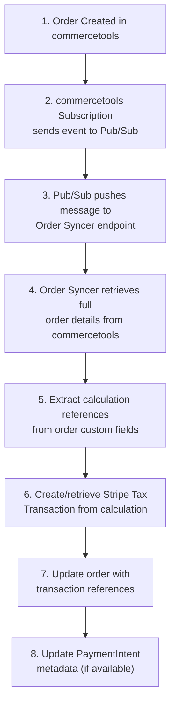
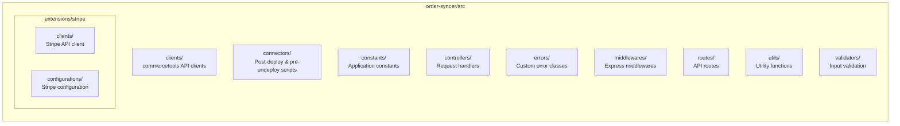

# Order Syncer Module

The Order Syncer module is a [commercetools Connect](https://docs.commercetools.com/connect) event handler that synchronizes completed orders to [Stripe Tax](https://stripe.com/tax) for tax reporting and compliance. It listens to order creation events via Google Cloud Pub/Sub and creates corresponding tax transactions in Stripe.

## Overview

This module handles order synchronization by:

1. Receiving order creation events from commercetools via Google Cloud Pub/Sub
2. Retrieving order and payment information from commercetools
3. Converting tax calculations to tax transactions in Stripe
4. Updating order metadata with transaction references
5. Linking transactions to Stripe PaymentIntent (if available)


## Key Features

- **Automatic Order Sync**: Orders are automatically synced when created in commercetools
- **Tax Transaction Creation**: Converts tax calculations to finalized Stripe transactions
- **Payment Integration**: Links tax transactions to Stripe PaymentIntent metadata with comma-separated IDs
- **Multi-Calculation Support**: Handles orders with multiple tax calculations (from multiple shipping methods)
- **Event-Driven Architecture**: Uses Google Cloud Pub/Sub for reliable message delivery
- **Idempotent Processing**: Detects existing transactions using regex extraction from Stripe error messages
- **Base64 Message Decoding**: Decodes Pub/Sub message data for processing
- **Order with Payment Retrieval**: Fetches full order details including payment information from commercetools

## Prerequisites

Before using this module, ensure you have:

1. **commercetools Project**: Active project with API client credentials
2. **Stripe Account**: Stripe Tax enabled with proper configuration
3. **Google Cloud Project**: For Pub/Sub messaging (auto-created by Connect in production)
4. **Tax Calculator**: The Tax Calculator module must be deployed first

## Quick Start

### Installation

```bash
cd order-syncer
npm install
```

### Local Development

For local development, you need to set up Google Cloud Pub/Sub manually:

1. Copy `.env.example` to `.env` and fill in your credentials
2. Set up Google Cloud authentication (see [GCP Auth Setup](#google-cloud-auth-setup))
3. Create a Pub/Sub topic and subscription
4. Use [ngrok](https://ngrok.com/) to expose your local server
5. Configure the subscription to push to your ngrok URL
6. Start the development server:

```bash
npm run start:dev
```

### Running Tests

```bash
# Unit tests
npm run test:unit

# Integration tests
npm run test:integration

# All tests
npm run test
```

### Deployment Scripts

```bash
# Post-deploy: Creates subscription and custom types
npm run connector:post-deploy

# Pre-undeploy: Removes subscription and cleans up
npm run connector:pre-undeploy
```

## API Endpoints

### POST /orderSyncer

Main endpoint for order synchronization. Receives Pub/Sub push messages when orders are created.

**Request:** (From Google Cloud Pub/Sub)
```json
{
  "message": {
    "messageId": "12345",
    "publishTime": "2024-01-15T10:30:00Z",
    "data": "<base64-encoded-order-event>"
  }
}
```

**Decoded Message Data:**
```json
{
  "notificationType": "ResourceCreated",
  "resource": {
    "typeId": "order",
    "id": "order-uuid"
  }
}
```

**Status Codes:**
- `204 No Content`: Order synchronized successfully
- `202 Accepted`: Message acknowledged (missing data, logged)
- `500 Internal Server Error`: System errors

## Configuration

### Required Environment Variables

| Variable | Description |
|----------|-------------|
| `CTP_PROJECT_KEY` | commercetools project key |
| `CTP_CLIENT_ID` | commercetools API client ID |
| `CTP_CLIENT_SECRET` | commercetools API client secret |
| `CTP_SCOPE` | commercetools API client scope |
| `CTP_REGION` | commercetools project region (e.g., `us-central1.gcp`, `europe-west1.gcp`) |
| `STRIPE_API_TOKEN` | Stripe API secret key (starts with `sk_live_` or `sk_test_`) |

### Custom Type Configuration

| Variable | Description | Default |
|----------|-------------|---------|
| `CUSTOM_TYPE_ORDER_KEY` | Custom type key for order tax references | `connector-stripe-tax-calculation-reference` |

### Local Development Variables

These variables are only needed for local development. In production, Connect sets them automatically:

| Variable | Description |
|----------|-------------|
| `CONNECT_GCP_TOPIC_NAME` | Google Cloud Pub/Sub topic name |
| `CONNECT_GCP_PROJECT_ID` | Google Cloud project ID |

## Architecture

### Order Sync Flow



### Transaction Handling

**Single Calculation (Most Common):**
- Order has one `calculationReference` from cart
- Calls `getTransactionFromTaxCalculation()` to retrieve or create transaction
- Handles "already exists" errors gracefully using regex to extract existing transaction ID
- Links transaction to order

**Multiple Calculations (Multiple Shipping):**
- Order has multiple `calculationReferences`
- Calls `createTaxTransactions()` to batch create transactions
- Iterates through calculation references
- Sets metadata with order ID and payment intent ID
- Links all transaction IDs to order

### Stripe Tax Transaction Client

The `extensions/stripe/clients/client.js` provides:

| Method | Purpose |
|--------|---------|
| `getTransactionFromTaxCalculation()` | Creates or retrieves transaction from calculation ID |
| `createTaxTransactions()` | Batch creates multiple transactions from calculation references |
| `updatePaymentIntentMetadata()` | Updates PaymentIntent with comma-separated transaction IDs |

**Idempotency Handling:**
- When Stripe returns "transaction already exists" error
- Uses regex pattern to extract existing transaction ID from error message
- Returns existing transaction ID instead of failing

### Component Structure



### Key Components

| Component | Purpose |
|-----------|---------|
| `sync.controller.js` | Main order sync handler |
| `query.client.js` | Fetches order and payment data from commercetools |
| `update.client.js` | Updates order with transaction references |
| `stripe/clients/client.js` | Stripe Tax API operations |

## Custom Types

The module uses the same custom type as the Tax Calculator for storing calculation and transaction references:

| Custom Type | Applied To | Key |
|-------------|------------|-----|
| `connector-stripe-tax-calculation-reference` | `order` | Configurable via `CUSTOM_TYPE_ORDER_KEY` |

**Custom Type Fields:**
- `connectorStripeTax_calculationReferences` (Array of String) - Stripe calculation IDs from cart
- `connectorStripeTax_transactionReferences` (Array of String) - Stripe transaction IDs created during sync
- `connectorStripeTax_amountTotal` (Number) - Total amount including tax
- `connectorStripeTax_taxAmountExclusive` (Number) - Exclusive tax amount
- `connectorStripeTax_taxAmountInclusive` (Number) - Inclusive tax amount
- `connectorStripeTax_currencies` (Array of String) - Currencies used in calculations

## Google Cloud Auth Setup

For local development, follow these steps to set up Google Cloud authentication:

### Step 1: Install Google Cloud SDK

Install the [Google Cloud SDK](https://cloud.google.com/sdk/docs/install) on your local machine.

### Step 2: Authenticate and Configure

```bash
# Login to Google Cloud
gcloud auth login

# Set your project
gcloud config set project your-project-id
```

### Step 3: Create Service Account

```bash
# Create service account
gcloud iam service-accounts create commercetools-pubsub \
    --display-name="Commercetools Pub/Sub Publisher" \
    --project=your-project-id

# Grant publisher permissions
gcloud projects add-iam-policy-binding your-project-id \
    --member="serviceAccount:commercetools-pubsub@your-project-id.iam.gserviceaccount.com" \
    --role="roles/pubsub.publisher"
```

### Step 4: Create Service Account Key

```bash
gcloud iam service-accounts keys create commercetools-key.json \
    --iam-account=commercetools-pubsub@your-project-id.iam.gserviceaccount.com \
    --project=your-project-id
```

### Step 5: Create Pub/Sub Topic and Subscription

```bash
# Create topic
gcloud pubsub topics create ct-stripe-tax-topic --project=your-project-id

# Create push subscription pointing to your ngrok URL
gcloud pubsub subscriptions create ct-stripe-tax-subscription \
    --topic=ct-stripe-tax-topic \
    --push-endpoint=https://your-ngrok-url.ngrok.io/orderSyncer \
    --project=your-project-id
```

### Step 6: Test the Setup

```bash
# Publish a test message
gcloud pubsub topics publish ct-stripe-tax-topic \
    --message="Test message" \
    --project=your-project-id
```

## Stripe Integration

### Tax Transactions

When an order is synchronized, the module:

1. Retrieves the `calculationReferences` from the order's custom fields (set by Tax Calculator)
2. For single calculation: Calls `getTransactionFromTaxCalculation()` to get or create transaction
3. For multiple calculations: Calls `createTaxTransactions()` to batch create transactions
4. Stores `transactionReferences` array back on the order custom fields
5. Handles "already exists" errors by extracting existing transaction ID via regex

### PaymentIntent Metadata

If the order has a linked Stripe PaymentIntent, the module updates its metadata:

```json
{
  "metadata": {
    "tax_transaction_ids": "txn_xxx,txn_yyy"
  }
}
```

**Implementation Details:**
- Transaction IDs are stored as comma-separated string
- Error handling with fallback (logs warning, continues if update fails)
- Metadata update is non-blocking to prevent sync failure

This enables:
- Linking payments to tax transactions for reconciliation
- Tracking tax liability per payment
- Compliance reporting
- Audit trail for tax calculations to transactions

## Error Handling

| Error Type | HTTP Status | Description |
|------------|-------------|-------------|
| Missing Message Data | 202 | Message acknowledged but no data to process |
| Invalid Message Format | 202 | Message format validation failed |
| Order Not Found | 500 | Order ID not found in commercetools |
| Stripe API Error | 500 | Error creating transaction in Stripe |
| PaymentIntent Update Failed | Warning | Logged but doesn't fail sync (non-blocking) |

### Message Validation

The `validators/order-change.validators.js` validates:
- Pub/Sub message structure
- Message body has required fields
- Base64-encoded data can be decoded

### Idempotency

The module handles duplicate syncs gracefully:
- Checks if transaction already exists for calculation
- Extracts existing transaction ID from Stripe error message using regex
- Returns existing transaction instead of creating duplicate

## Development

### Project Structure

```
order-syncer/
  src/
    clients/          # commercetools API clients
    connectors/       # Post-deploy and pre-undeploy scripts
    constants/        # Application constants
    controllers/      # Request handlers
    errors/           # Custom error classes
    extensions/       # External service integrations
    middlewares/      # Express middlewares
    routes/           # API routes
    utils/            # Utility functions
    validators/       # Input validation
  test/
    unit/             # Unit tests
    integration/      # Integration tests
  docs/
    images/           # Architecture diagrams
```

### Code Style

- ESLint for linting: `npm run lint`
- Prettier for formatting: `npm run prettier`
- No emojis in source code (see project CLAUDE.md)

## Additional Documentation

For more detailed documentation, see:

- [Root README](../README.md) - Project overview and architecture
- [Configuration Guide](../context/ARCHITECTURE.md) - Detailed environment variable reference
- [Deployment Guide](../context/deployment.md) - Step-by-step deployment instructions
- [Tax Code Guide](../context/business-rules/tax-code-resolution.md) - Tax code configuration and mapping
- [Troubleshooting Guide](../context/known-issues.md) - Common issues and solutions
- [connect.yaml](../connect.yaml) - Complete deployment configuration
