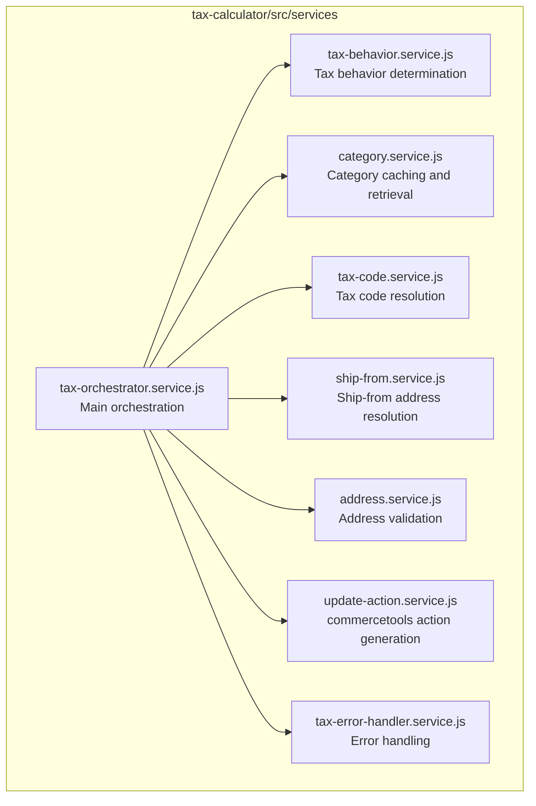

# Tax Calculator Module

The Tax Calculator module is a [commercetools Connect](https://docs.commercetools.com/connect) service that provides real-time tax calculation using [Stripe Tax](https://stripe.com/tax). It is triggered automatically by a commercetools [API Extension](https://docs.commercetools.com/api/projects/api-extensions) when a cart is created or updated.

## Overview

This module calculates sales tax for cart line items and shipping by:

1. Receiving cart data from commercetools via API Extension
2. Resolving tax codes from product categories
3. Determining ship-from addresses for accurate tax jurisdiction
4. Calling Stripe Tax API for tax calculation
5. Returning commercetools update actions to apply taxes to the cart

## Key Features

- **Real-time Tax Calculation**: Automatic tax calculation when carts are created/updated
- **Address Validation**: Two-tier validation (local rules + Stripe verification) with 23 country-specific formats
- **Tax Code Resolution**: 5-strategy hierarchical lookup with parent category traversal (max depth 10)
- **Ship-From Resolution**: Multi-strategy address resolution (line item supply channel, inventory entry channel, default)
- **Tax Behavior Configuration**: Configurable inclusive/exclusive tax by country mapping or merchant default
- **Multiple Shipping Support**: Handles Single and Multiple shipping modes with proportional line item distribution
- **Multi-Warehouse Support**: Groups line items by ship-from address for accurate tax jurisdiction
- **Category Caching**: In-memory cache with 5-minute TTL for performance
- **Batch Processing**: Efficient handling of large catalogs (>500 products) with max 5 concurrent requests
- **Tax Breakdown Matching**: 3-strategy algorithm for accurate rate application
- **Shipping Tax Code Lookup**: Retrieves tax codes from custom fields on shipping methods

## Prerequisites

Before using this module, ensure you have:

1. **commercetools Project**: Active project with API client credentials
2. **Stripe Account**: Stripe Tax enabled with head office address configured
3. **Tax Registration**: Completed for countries where you sell

## Quick Start

### Installation

```bash
cd tax-calculator
npm install
```

### Local Development

1. Copy `.env.example` to `.env` and fill in your credentials
2. Create a commercetools API Extension pointing to your local server
3. Use [ngrok](https://ngrok.com/) to expose your local server to the internet
4. Start the development server:

```bash
npm run start:dev
```

### Running Tests

```bash
# Unit tests
npm run test:unit

# Integration tests
npm run test:integration

# All tests
npm run test
```

### Deployment Scripts

```bash
# Post-deploy: Creates extension and custom types
npm run connector:post-deploy

# Pre-undeploy: Removes extension and cleans up
npm run connector:pre-undeploy
```

## API Endpoints

### POST /taxCalculator

Main endpoint for tax calculation. Triggered automatically by commercetools API Extension.

**Trigger Conditions (DSL):**
```
taxMode="ExternalAmount"
AND lineItems is defined AND lineItems is not empty
AND (shippingInfo is defined OR lineItems(shippingDetails is defined))
AND (
  paymentInfo is not defined
  OR (taxedPrice is not defined AND custom(fields(connectorStripeTax_calculationReferences is defined)))
  OR (shippingMode="Single" AND shippingInfo is defined AND shippingInfo(taxedPrice is not defined)
      AND custom(fields(connectorStripeTax_calculationReferences is defined)))
)
AND (taxMode OR lineItems OR shippingInfo OR shippingAddress OR shipping OR itemShippingAddresses has changed)
```

**Key Behaviors:**
- **Normal path**: skips when `paymentInfo` exists and cart is already fully taxed
- **Re-apply path**: when `paymentInfo` is present but `taxedPrice` was cleared by a CT platform update (e.g. `setShippingAddress`) and `connectorStripeTax_calculationReferences` already exist on the cart, retrieves the existing Stripe calculation and re-emits the same update actions without creating a new calculation

**Timeout:** 2000ms

**Response:**
```json
{
  "actions": [
    {
      "action": "setCustomType",
      "type": { "key": "connector-stripe-tax-calculation-reference", "typeId": "type" },
      "fields": { "calculationReferences": ["calcref_xxx"] }
    },
    {
      "action": "setLineItemTaxAmount",
      "lineItemId": "line-item-id",
      "externalTaxAmount": {
        "totalGross": { "centAmount": 10800, "currencyCode": "USD" },
        "taxRate": {
          "name": "Sales Tax",
          "amount": 0.08,
          "includedInPrice": false,
          "country": "US",
          "state": "CA"
        }
      }
    }
  ]
}
```

**Status Codes:**
- `202 Accepted`: Tax calculation successful
- `400 Bad Request`: Validation errors (missing address, invalid tax code)
- `500 Internal Server Error`: System errors

### POST /validateAddress

Validates shipping addresses using local rules and Stripe verification.

**Request:**
```json
{
  "address": {
    "line1": "123 Main St",
    "city": "San Francisco",
    "state": "CA",
    "postal_code": "94105",
    "country": "US"
  }
}
```

**Response:**
```json
{
  "success": true,
  "validation": {
    "local": { "isValid": true, "errors": [] },
    "stripe": { "accepted": true }
  },
  "address": { "suggestions": [] }
}
```

## Configuration

### Required Environment Variables

| Variable | Description |
|----------|-------------|
| `CTP_PROJECT_KEY` | commercetools project key |
| `CTP_CLIENT_ID` | commercetools API client ID |
| `CTP_CLIENT_SECRET` | commercetools API client secret |
| `CTP_SCOPE` | commercetools API client scope |
| `CTP_REGION` | commercetools project region (e.g., `us-central1.gcp`, `europe-west1.gcp`) |
| `STRIPE_API_TOKEN` | Stripe API secret key (starts with `sk_live_` or `sk_test_`) |
| `TAX_CODE_CATEGORY_MAPPING_JSON` | JSON mapping commercetools categories to Stripe tax codes |

### Tax Behavior Configuration

| Variable | Description | Default |
|----------|-------------|---------|
| `TAX_BEHAVIOR_DEFAULT` | Default tax behavior (`inclusive` or `exclusive`) | `exclusive` |
| `TAX_BEHAVIOR_COUNTRY_MAPPING` | JSON mapping country codes to tax behaviors | See connect.yaml |

**Example Country Mapping:**
```json
{
  "US": "exclusive",
  "CA": "exclusive",
  "DE": "inclusive",
  "FR": "inclusive",
  "GB": "inclusive"
}
```

### Tax Code Configuration

| Variable | Description |
|----------|-------------|
| `TAX_CODE_CATEGORY_MAPPING_JSON` | JSON mapping commercetools categories to Stripe tax codes |
| `CUSTOM_TYPE_PRODUCT_KEY` | Custom type key for product tax codes (default: `connector-stripe-tax-product`) |
| `CUSTOM_TYPE_CATEGORY_KEY` | Custom type key for category tax codes (default: `connector-stripe-tax-category`) |
| `CUSTOM_TYPE_SHIPPING_KEY` | Custom type key for shipping tax codes (default: `connector-stripe-tax-shipping`) |
| `CUSTOM_TYPE_CART_KEY` | Custom type key for cart references (default: `connector-stripe-tax-calculation-reference`) |

### Ship-From Configuration

| Variable | Description | Default |
|----------|-------------|---------|
| `SHIP_FROM_REQUIRED` | Require ship-from address | `true` |
| `SHIP_FROM_DEFAULT_BUSINESS_COUNTRY` | Default country | - |
| `SHIP_FROM_DEFAULT_BUSINESS_STATE` | Default state/province | - |
| `SHIP_FROM_DEFAULT_BUSINESS_CITY` | Default city | - |
| `SHIP_FROM_DEFAULT_BUSINESS_POSTAL_CODE` | Default postal code | - |
| `SHIP_FROM_DEFAULT_BUSINESS_LINE1` | Default street address line 1 | - |
| `SHIP_FROM_DEFAULT_BUSINESS_LINE2` | Default street address line 2 | - |
| `SHIP_FROM_CHANNEL_PRIORITY` | Comma-separated channel IDs for priority selection | - |

### Address Validation Configuration

| Variable | Description | Default |
|----------|-------------|---------|
| `ADDRESS_VALIDATION_STRIPE_DEFAULT_CURRENCY` | Default currency for Stripe verification | `usd` |

## Architecture

### Service Components



### Tax Orchestration Service

The `tax-orchestrator.service.js` coordinates two distinct flows depending on the cart state detected by the controller:

#### Normal Path (6-Step Process)

Triggered when `paymentInfo` is absent — a standard checkout tax calculation:

1. **Determine Tax Behavior**: Check country-specific mapping first, then merchant default, then Stripe default (null)
2. **Fetch Product Categories**: Retrieve categories from commercetools with caching (5-min TTL)
3. **Group Line Items by Ship-From**: Create unique address keys from country/state/city/postal_code
4. **Create Stripe Requests**:
   - **Single Mode**: One shipping method = single tax calculation request
   - **Multiple Mode**: Multiple shipping methods = separate calculations per method with proportional distribution
5. **Execute Tax Calculations**: Parallel execution with `Promise.allSettled`
6. **Combine Results**: Merge results and create commercetools update actions

#### Re-apply Path (`reapplyExistingCalculation`)

Triggered when the cart has `paymentInfo` but `taxedPrice` was cleared by a CT platform update (e.g. `setShippingAddress` after payment capture). In this case the normal path is blocked by the extension guard, so instead:

1. Read `connectorStripeTax_calculationReferences[0]` from the cart's custom fields
2. Retrieve the existing Stripe Tax calculation via `stripe.tax.calculations.retrieve()` (no new calculation created)
3. Re-emit the same line item, shipping, and cart-total update actions from the retrieved calculation

This keeps the PaymentIntent, cart, and order-syncer all referencing the same original `calculationId`.

### Tax Code Resolution

Tax codes are resolved via `tax-code.service.js`:

1. **Custom Type Category Tax Codes**: the service scans the categories directly assigned to the
   product and returns the first one whose custom field `connectorStripeTax_TaxCode` is set.
2. **Error**: if no category carries a code, it throws `TaxCodeNotFoundError` and the whole cart
   update fails. There is no default tax code — see
   [ADR-006](../context/decisions/adr-006-tax-code-resolution-strategy.md).

> **Only the category scan is active.** Three further strategies — product/line-item custom
> fields, the `TAX_CODE_CATEGORY_MAPPING_JSON` mapping, and parent-category traversal — exist in
> `tax-code.service.js` but are **commented out** (lines ~44-62). Earlier revisions of this README
> advertised them as a live "5-strategy hierarchy"; they are not reachable. Re-enabling any of them
> means uncommenting the branch and re-testing its supporting path
> (`findFirstTaxCodeInHierarchy` / `taxCodeMappingConfig`). See
> `context/business-rules/tax-code-resolution.md` Rule 2.

**Caching:** 5-minute TTL cache for shipping method API calls

### Tax Behavior Priority

The tax behavior (inclusive/exclusive) is determined in this order:

1. **Country Mapping**: If shipping country matches `TAX_BEHAVIOR_COUNTRY_MAPPING`
2. **Merchant Default**: Falls back to `TAX_BEHAVIOR_DEFAULT`
3. **Stripe Default**: If no behavior configured, Stripe uses its default

### Ship-From Resolution Priority

Ship-from address is resolved via `ship-from.service.js`:

1. **Line Item Supply Channel** (highest priority): Uses commercetools Channel API to get address from channel definition
2. **Inventory Entry Supply Channel** (for dropshipping): Queries Inventory API by SKU with intelligent channel selection:
   - **Priority-based**: Respects `SHIP_FROM_CHANNEL_PRIORITY` comma-separated list
   - **Stock-based**: Falls back to highest available quantity
3. **Default Business Address**: Uses `SHIP_FROM_DEFAULT_BUSINESS_*` environment variables
4. **Digital Products**: Returns null address if `SHIP_FROM_REQUIRED='false'`
5. **Error**: Throws `ShipFromNotFoundError` if `SHIP_FROM_REQUIRED='true'` and no address found

**Caching:** 5-minute TTL cache per channel ID

### Update Action Service

The `update-action.service.js` (1,300+ lines) creates commercetools cart update actions:

**Major Capabilities:**
- **Combine Multiple Calculations**: Merges results from separate Stripe requests
- **Line Item Total Price Actions**: Sets base amounts for ExternalTotal mode
- **Line Item Tax Amount Actions**: Sets tax breakdowns with effective tax rate calculation
- **Shipping Method Tax Actions**: Creates per-shipping-method tax updates
- **Cart Total Tax Action**: Sets overall cart tax (required for ExternalAmount mode)
- **Cart Custom Type Action**: Stores calculation references and metadata

**Tax Breakdown Matching (3-Strategy Algorithm):**
1. Match by calculated tax amount (percentage-based)
2. Match by most common tax type
3. Exact amount matching

**Effective Tax Rate Calculation:** Combines rates from multiple calculations proportionally when same line item appears in multiple calculations

## Custom Types

The module creates the following custom types during post-deploy:

| Custom Type | Applied To | Fields |
|-------------|------------|--------|
| `connector-stripe-tax-product` | `product-price`, `line-item` | `connectorStripeTax_TaxCode` (String) |
| `connector-stripe-tax-category` | `category` | `connectorStripeTax_TaxCode` (String) |
| `connector-stripe-tax-shipping` | `shipping-method` | `connectorStripeTax_TaxCode` (String) |
| `connector-stripe-tax-calculation-reference` | `cart`, `order` | See below |

**Cart/Order Custom Type Fields:**
- `connectorStripeTax_calculationReferences` (Array of String) - Stripe calculation IDs
- `connectorStripeTax_amountTotal` (Number) - Total amount including tax
- `connectorStripeTax_taxAmountExclusive` (Number) - Exclusive tax amount
- `connectorStripeTax_taxAmountInclusive` (Number) - Inclusive tax amount
- `connectorStripeTax_currencies` (Array of String) - Currencies used
- `connectorStripeTax_expiresAt` (Array of String) - Calculation expiration timestamps
- `connectorStripeTax_calculationTimestamp` (DateTime) - When calculation was performed

## Error Handling

The module handles errors via `tax-error-handler.service.js` and returns commercetools-compatible error responses:

### Custom Error Types

| Error Type | HTTP Status | Description |
|------------|-------------|-------------|
| `TaxCodeNotFoundError` | 400 | Product category has no tax code configured |
| `TaxCodeShippingNotFoundError` | 400 | Shipping method has no tax code configured |
| `ShipFromNotFoundError` | 400 | No ship-from address could be resolved |
| Address Invalid | 400 | Shipping address failed validation |
| Stripe API Error | 500 | Stripe Tax API returned an error |

### Stripe Error Code Mapping

The module maps Stripe error codes to actionable messages:

| Stripe Error Code | Description | Recommended Action |
|-------------------|-------------|-------------------|
| `taxes_calculation_failed` | Unsupported country or missing tax rate | Check country support and tax registration |
| `stripe_tax_inactive` | Tax not enabled in Stripe account | Enable Stripe Tax in dashboard |
| `customer_tax_location_invalid` | Invalid address for tax location | Verify shipping address |
| `shipping_address_invalid` | Invalid shipping address format | Check address fields |

### Address Validation Errors

The `address.service.js` provides user-friendly guidance with:
- Field-specific suggestions for validation errors
- Postal code format examples per country (23 countries supported)
- Country-currency mapping (USD, CAD, GBP, AUD, NZD, EUR defaults)

## Development

### Project Structure

```
tax-calculator/
  src/
    clients/          # commercetools API clients
    config/           # Configuration utilities
    connectors/       # Post-deploy and pre-undeploy scripts
    constants/        # Application constants
    controllers/      # Request handlers
    errors/           # Custom error classes
    middlewares/      # Express middlewares
    routes/           # API routes
    services/         # Business logic services
    utils/            # Utility functions
    validators/       # Input validation
  test/
    unit/             # Unit tests
    integration/      # Integration tests
```

### Code Style

- ESLint for linting: `npm run lint`
- Prettier for formatting: `npm run prettier`
- No emojis in source code (see project CLAUDE.md)

## Additional Documentation

For more detailed documentation, see:

- [Root README](../README.md) - Project overview and architecture
- [Configuration Guide](../context/ARCHITECTURE.md) - Detailed environment variable reference
- [Deployment Guide](../context/deployment.md) - Step-by-step deployment instructions
- [Tax Code Guide](../context/business-rules/tax-code-resolution.md) - Tax code configuration and mapping
- [Troubleshooting Guide](../context/known-issues.md) - Common issues and solutions
- [connect.yaml](../connect.yaml) - Complete deployment configuration
